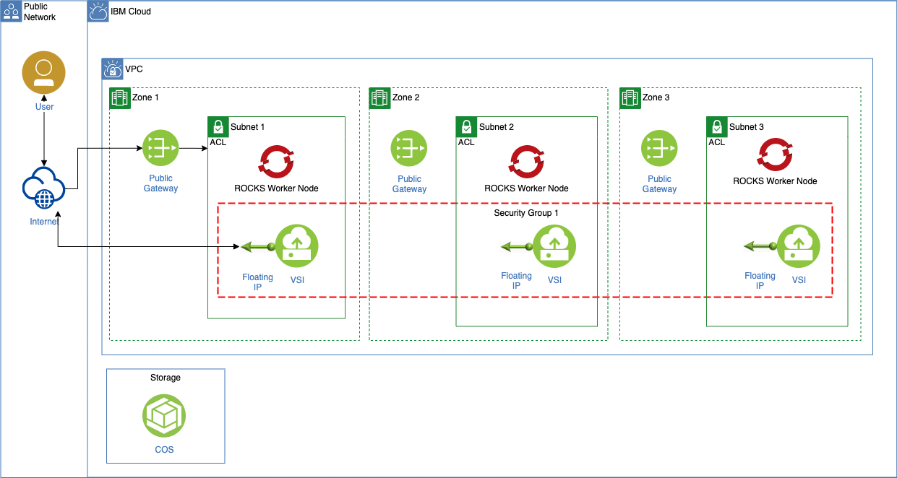

# Terraform Script for Satellite Presentation

Creating a VPC, VSI and ROCKS to use for satellite location demos.

**ARCHITECTURE**

The diagram shows the target architecture for this cheat sheet. We will create:

- One virtual private cloud (VPC).
- Three virtual server instances (VSI).
- One security group with a security group access control rule.
- Three subnets.
- Three public gateways.
- One floating IP for each vsi (to access the virtual server instance).
- One Red Hat Open Shift Cluster with one Worker Zone per Zone.
- One Cloud Object Storage.

